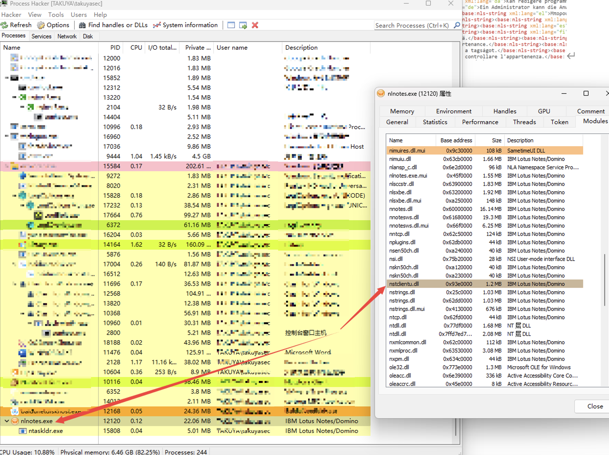
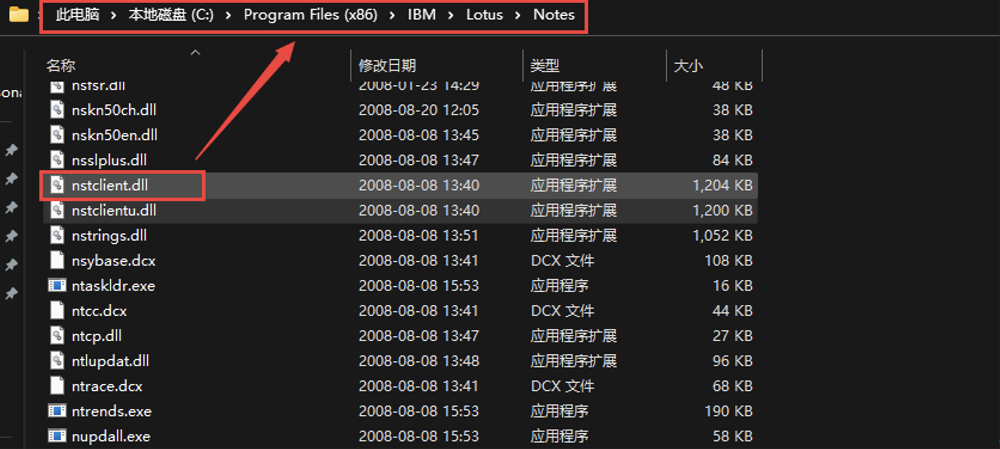
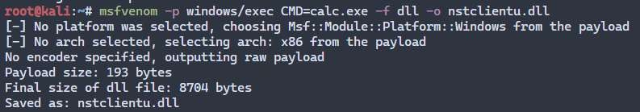
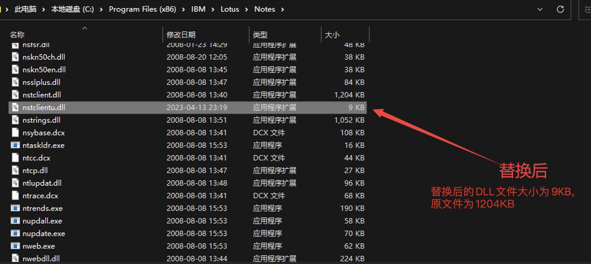
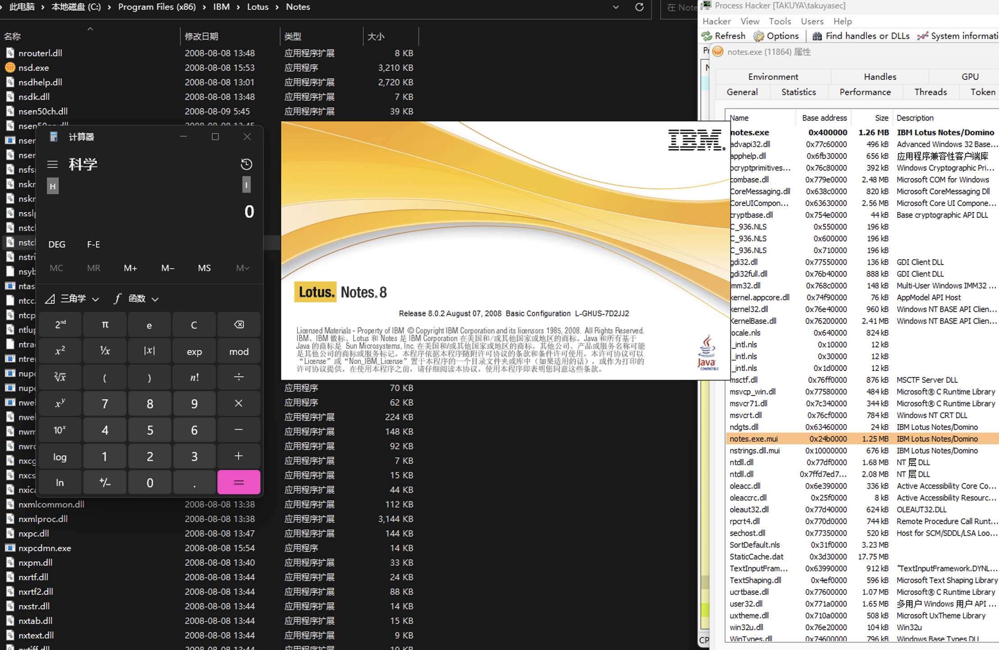
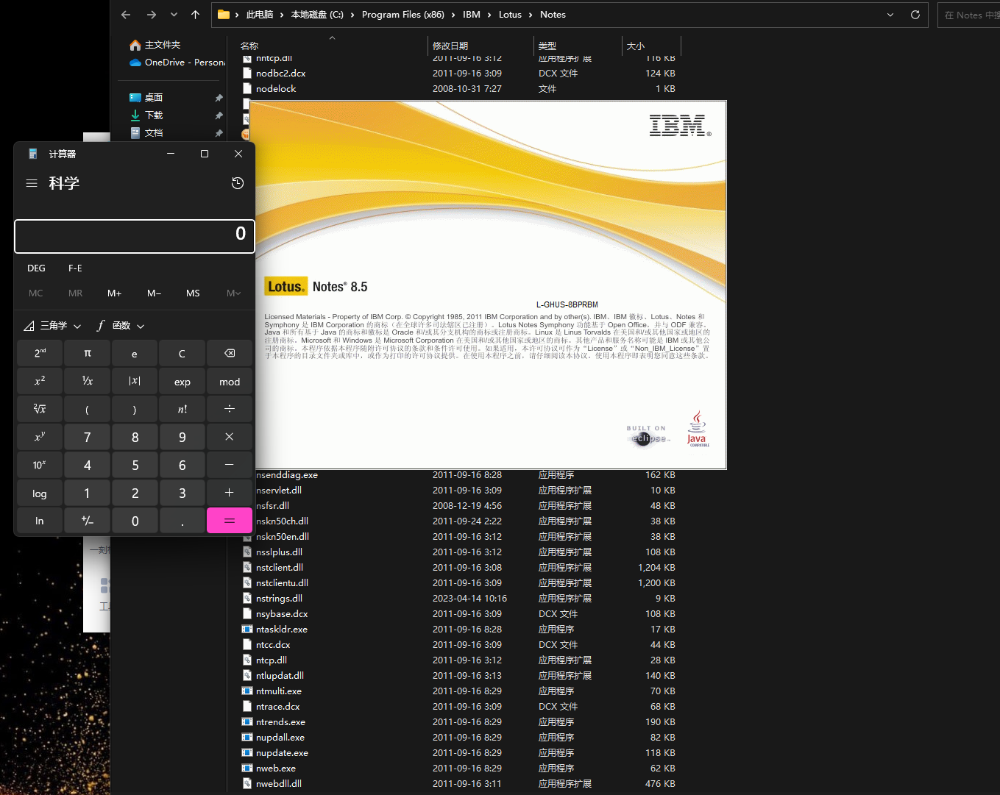

 

## 0x01 Introduce briefly

IBM Lotus Notes provides integrated collaboration functions, including email, calendar, contact management, task tracking, instant messaging, an office productivity suite (IBM Lotus Symphony) and access to other Lotus Domino applications. The ability of programs and databases. Lotus Notes can also integrate additional collaboration capabilities, including audio and video conferencing, online meetings, discussion groups, forums, blogs, file sharing, Weibo and user directories. In addition to these standard applications, organizations can also use the IBM Lotus Domino Designer development environment and other tools to develop additional integrated applications, such as request approval/workflow and document management.

 

## 0x02 Introduction to loopholes

There is a DLL hijacking vulnerability in more than 8 versions of IBM Lotus Notes. The program does not verify the DLL file during execution, resulting in the execution of the malicious DLL file. The DLL hijacking attack can take advantage of the vulnerability of the application to load the DLL file. Without correctly verifying the integrity of the DLL file, the attacker can replace the malicious DLL file with a real DLL file and be loaded and executed by the application, so as to obtain permissions or steal information.

## 0x03 Impact version

According to the test, the vulnerability affects the version: 8.0.2 ≤ Lotus Notes ≤ 8.5.3;

## 0x04 Reappearance of loopholes

The reproduction process takes version 8.0.2 as an example.

1. Use the process hacker to find the dll file loaded by the program, and find that nstclientu.dll needs to be loaded when the program is running;

 

2. Find the loaded nstclientu.dll, which is located in the program installation directory.

 

3. Use metasploit to generate a malicious dll, place the generated malicious dll file at the program loading location, and replace the original dll.

 

4. Run the program to observe whether payload is triggered, and the results show that the application has a DLL hijacking vulnerability.

 

5. Other versions were also tested later, such as version 8.5.3. The test results show that there is also a DLL hijacking vulnerability.

## 0x05 Suggestions for repair

Application vendors can deal with the vulnerability through the following points:

1. Update the program and fix the bugs;

2. Compile the program by static linking;

3. Use code signature to verify the identity of DLL;

4. Restrict access to the program;

5. Disable the unnecessary Windows DLL search mechanism;

6. Use tools to detect DLL hijacking vulnerabilities in the system